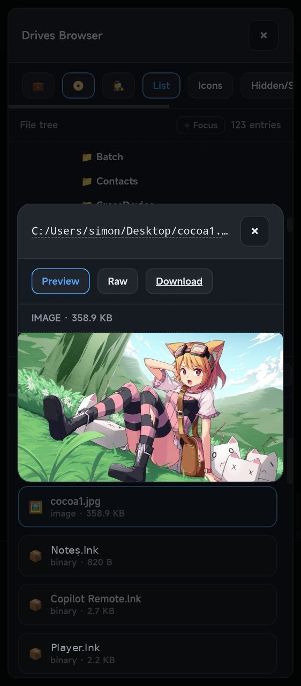

# Copilot Remote

Drive your local coding agents from any browser (phone, tablet, or second computer) through a self-hosted web relay.

GitHub Copilot CLI is the default runtime, and two more can be enabled per conversation: **OpenAI (BYOK)** and **Claude (Agent SDK)**. All three share the same chat UI, queue, history, file browser, and question cards — you pick the runtime when you start a conversation.

```text
                                            ┌── Copilot CLI session  (default)
[Browser] <--WebSocket--> [server.js :3333] ┼── OpenAI BYOK worker   (your API key)
                                            └── Claude worker        (host's Claude login)
```

## In action

Copilot Remote is built to feel at home on both desktop and mobile. Your conversations can follow you from a browser tab to a PWA install, with file browsing and previews built in.

<div align="center">
<table width="100%" cellspacing="0" cellpadding="0">
<tr>
<td rowspan="2" width="40%" align="center" valign="middle">
<a href="docs/screenshots/mobile_session.jpg" target="_blank" rel="noopener noreferrer">

</a>
<div align="center"><small>Mobile session view with the composer and a PWA-style fullscreen layout.</small></div>
</td>
<td width="60%" align="right" valign="top">
<a href="docs/screenshots/desktop_pwa_chrome.png" target="_blank" rel="noopener noreferrer">

</a>
<div align="center"><small>Desktop PWA App (Chrome), chat view with session list.</small></div>
</td>
</tr>
<tr>
<td width="60%" align="right" valign="bottom">
<a href="docs/screenshots/desktop_pwa_file_viewer.png" target="_blank" rel="noopener noreferrer">

</a>
<div align="center"><small>Integrated file viewer for previews and inline file browsing.</small></div>
</td>
</tr>
</table>
</div>

## What this repository provides

Copilot Remote is split into three pieces:

1. **Web relay server** (`server/`): queueing, persistence, auth, browser UI, file browser, uploads, and the OpenAI BYOK image path.
2. **Copilot CLI extension** (`.github/extensions/web-relay/`): polls the relay, executes turns, streams activity, bridges `ask_user` questions into web question cards.
3. **Claude worker** (`server/claude-worker/`): a per-conversation Node process that runs turns through the Claude Agent SDK and speaks the same relay contracts as the Copilot workers.


## Project Status

Copilot Remote is still under active development, so expect occasional rough edges and some provider SDK features to be missing or incomplete for now.


## Highlights

- Remote chat UI for local coding agents — Copilot CLI, OpenAI (BYOK), or Claude (Agent SDK), chosen per conversation
- Per-message **mode** picker: `plan`, `ask`, `agent`, `autopilot`
- Per-message **model** and **reasoning effort** pickers (live model discovery + fallback catalog)
- Streaming tool/activity updates *and* live assistant reply text while a turn runs
- Nested **subagent bubbles**: each subagent gets its own live bubble with its own thoughts, activity, and streamed text, kept as collapsible sections after the turn finishes
- Mathematical and scientific notation rendering for TeX/LaTeX equations and chemical formulas
- Web question cards for `ask_user` clarification flows (single-field text and multi-field structured forms)
- Structured answer support: multi-field elicitation with JSON schema validation and UI-rendered forms
- **Context usage** modal with a per-category token breakdown of the model's context window
- **Image conversations** (OpenAI BYOK): generate images in chat and iterate on a generated image with *Edit this image*
- **Share** a conversation by link, with per-message *Hide from shares* control
- Conversation history stored in local SQLite
- Conversation delete requests are relayed to Copilot CLI SDK `deleteSession()` so web deletes can remove resumable CLI sessions
- Conversation **compact** workflow (`/compact`) to continue with summary carry-over
- Workspace + drives browser with file preview, raw file access, and sticky hidden/heavy filters
- `@file:` and `@folder:` reference tokens with copy-to-clipboard helpers
- Uploads and image attachment relay support
- Optional SSH reverse tunnel support for internet access
- PWA install support with installed-app fullscreen preference and browser-mode fallbacks

## Prerequisites

Only Node.js and the runtime you actually intend to use are required.


| Requirement                  | Needed for                    | Notes                                     |
| ---------------------------- | ----------------------------- | ----------------------------------------- |
| Node.js 18+                  | always                        | Runs the relay server                     |
| GitHub CLI (`gh`)            | Copilot provider              | Must be available in PATH                 |
| GitHub Copilot CLI extension | Copilot provider              | `gh extension install github/gh-copilot`  |
| Copilot subscription         | Copilot provider              | Individual, Business, or Enterprise       |
| OpenAI API key               | OpenAI + OpenAI Image chats   | Entered in **⚙️ Settings**, stored locally |
| Claude Code CLI, logged in   | Claude chats                  | Run `claude` once on the relay host; no API key is stored by the relay |


## Quick start

```bash
git clone https://github.com/materia79/copilot-remote
cd copilot-remote
npm install
```

Create `server/config.json`:

```json
{
  "authToken": "change-me",
  "port": 3333,
  "localhostOnly": true,
  "pollIntervalMs": 3000,
  "processingTimeoutMs": 600000,
  "conversationSessionMode": "isolated"
}
```

Start Copilot with the relay extension:

```bash
npm run copilot:relay
```

If you installed the extension globally in `~/.copilot/extensions/web-relay/`, you can also start plain Copilot from any repository:

```bash
gh copilot
```

In that setup, the extension auto-starts and supervises `server.js` for the active CLI session; `npm run copilot:relay` is just a convenience launcher for this repository.

On Windows, the relay's visible launcher path now targets a stable per-workspace Windows Terminal window name so later foreground launches reuse the same window instead of opening new desktop windows. Use the hidden/stdio fallback only when you explicitly need it.

Open:

```text
http://<your-pc-ip>:3333/
```

When `localhostOnly` is `true`, use `http://localhost:3333/` from the same machine.

Sign in once with your token. The relay then uses an HttpOnly auth cookie.

For day-to-day development workflows, relay restart steps, and worker debugging notes, see [`DEVELOPING.md`](./DEVELOPING.md).

## Runtime modes and startup commands

| Command                 | Purpose                                                                                                                                   |
| ----------------------- | ----------------------------------------------------------------------------------------------------------------------------------------- |
| `copilot-remote`        | Global npm command (after `npm link` or `npm install -g .`) that starts the web relay if needed, then runs `gh copilot` in the same shell |
| `copilot-remote --install-extension` | Installs/updates a user-global `web-relay` wrapper entrypoint and exits                                                                |
| `npm run copilot:relay` | Starts Copilot CLI with an initial prompt so the extension loads and the relay worker link comes online                                      |
| `npm run start:server`  | Server only (use with an active Copilot CLI session that loads the extension)                                                             |
| `npm start`             | Standalone development mode (`server.js` + `relay.mjs`)                                                                                   |

### Single runtime owner rule

Run only one relay owner at a time:

1. **Extension-managed mode**: Copilot CLI extension owns the relay worker WebSocket and fallback dequeue loop.
2. **Standalone mode**: `npm start` handles the relay runtime itself.

Do not run extension-managed relay transport together with standalone relay runtime transport.
Do not restart the web relay unless the user has explicitly given permission.
If a manual restart is requested, use `POST /api/relay/shutdown` only.
Do not run tests that spawn Copilot CLI clients unless the user explicitly permits it.

In extension-managed mode, the worker WebSocket begins after the CLI session becomes active (typically after the first prompt), with HTTP dequeue kept only as fallback when the socket is unavailable.
The extension now supervises managed `server.js` restarts (bounded backoff) while the CLI session is alive, and stops restart attempts on session shutdown.
When the CLI extension connects, it also prints the relay info window (local/network/remote/auth URLs) directly in the Copilot CLI client.

On Windows, **Settings → Autostart (Windows)** can add a per-user Startup entry. It opens a visible terminal at sign-in and runs the installed `node server\server.js` path. This starts only the web relay server; a Copilot CLI session using the extension must attach separately before queued turns can be processed. Turning the setting off removes the copilot-remote Startup entry.

Respawner scripts (`start:server:respawn`*) are legacy/manual troubleshooting tools only and are not part of the extension-managed startup path.
Do not use them for manual restarts; use `POST /api/relay/shutdown` instead.

Manual relay control details:

- `POST /api/relay/shutdown` without `restart` queues a normal relay shutdown.
- `POST /api/relay/shutdown` with `restart: true` queues an intentional self-restart.
- Requests are localhost-only and still require relay auth.
- The relay waits until the queue is idle before acting; this endpoint does not interrupt an in-flight turn.
- `/api/status` exposes the queued relay exit state as `relayShutdown` so the UI/logs can distinguish idle, queued, and shutting-down restart/shutdown flows.
- Self-restart stays owner-aware:
  - extension-managed mode restarts under the extension-managed server lifecycle
  - `npm start` restarts under `server/start.js`
  - bare `node server/server.js` now follows the `playground/scripts/self_restart` pattern: `server.js` stays attached as the supervisor and respawns a worker child in the same terminal session

### Global npm command (Windows first)

You can install the repo locally and get a global `copilot-remote` command without publishing:

```powershell
npm link
# or
npm install -g .
```

Run it from any folder to start the web relay server for that folder's workspace root, then immediately hand the shell to `gh copilot` without a bootstrap prompt. If a relay is already active, the command reuses it and still opens Copilot in the same shell.

Relay server output is written to a logfile under `%LOCALAPPDATA%\copilot-remote\logs` by default (or `COPILOT_WEB_RELAY_LOG_DIR` if you set it), so it stays out of the CLI terminal.

If you want custom token/tunnel settings from a specific `server/config.json`, point `COPILOT_WEB_RELAY_CONFIG` at that file before launching. A plain `npm install -g .` does not bundle the repo-local gitignored config file.

Manual relay shutdowns are queued via `POST /api/relay/shutdown` and only take effect after the current turn goes idle, so they are not a way to interrupt a turn in progress.

Roadmap for later launcher modes:

1. **Option 2**: launch/attach a Copilot CLI session directly.
2. **Option 3**: support `copilot-remote -- [gh copilot args]` pass-through.
3. **Session resume**: add `--session-id=<...>` handoff once the session orchestration contract is defined.

## Using the web UI

On startup, the relay imports locally persisted Copilot sessions through the installed Copilot SDK into its database. Session lists, details, sharing, and history refreshes use that database; an unavailable SDK runtime is reported as an import failure and is not replaced with filesystem discovery.

- Start a chat with **New Chat**, which asks for the **provider**, **model**, and **reasoning effort** (or **quality** and **size**, for image chats) before the conversation exists.
- Choose **mode** and **model** per message in the composer.
- Use **Compact** to branch to a fresh conversation seeded with summary context.
- Use **Browse files** to inspect workspace/drives and open previews. The **Hidden** and **Heavy** toolbar filters are remembered per browser, and a refresh re-opens the folders you had expanded.
- Click file/folder copy controls to insert `@file:...` / `@folder:...` tokens.
- Answer clarification prompts in relay question cards (from `ask_user`, or Claude's `AskUserQuestion`).
- Watch the reply arrive: assistant text streams into the pending bubble as it is generated, and any subagent the turn spawns gets its own nested bubble with its own thoughts, activity, and text.
- Use the usage button (`📊`) for a live GitHub Copilot plan usage summary. It is recorded only for Copilot turns — OpenAI and Claude turns do not consume Copilot premium requests, and no usage line is attached to them.
- Use the **Context** button for a per-category breakdown of the conversation's context window: a usage bar, a token/percentage table, and free space. Claude sessions report exact SDK categories; Copilot sessions show the coarser system/tools + messages + buffer split, labelled as a lower-bound estimate when the runtime no longer emits full buckets.
- Use **Share** in the conversation menu to publish a read-only link. Hover any message and choose **Hide from shares** to keep it out of the shared view without deleting it; hidden messages stay fully visible to you and are marked as hidden.
- External links in chat open in a new tab with `noopener`/`noreferrer`; workspace file mentions stay in the in-app preview.
- Workspace browsing follows the selected CLI session's effective CWD. Running sessions keep their learned runtime CWD, menu changes update the next-launch CWD, and chat `cd ...` commands do not retarget the browser.

## Providers

The provider is chosen in **New Chat** and then fixed for that conversation: once a conversation has sent its first message it keeps that provider, and its composer is locked to that provider's models.

Turning a provider **off** (or removing the OpenAI key) rebinds conversations that have not yet sent a message back to Copilot, so you are never left with a conversation pointing at a runtime that can no longer start. Conversations already in flight, and conversations belonging to a different provider, are left alone.


| Provider              | Enable via                              | Auth                                  | Notes                                                                 |
| --------------------- | --------------------------------------- | ------------------------------------- | --------------------------------------------------------------------- |
| **Copilot** (default) | always available                        | your `gh` / Copilot CLI login         | Full relay feature set; the only provider that reports Copilot usage   |
| **OpenAI (BYOK)**     | ⚙️ Settings → OpenAI API key            | your API key, stored in the relay DB  | Runs the Copilot CLI in BYOK mode against an OpenAI-compatible endpoint |
| **OpenAI Image (BYOK)** | ⚙️ Settings → OpenAI API key           | same key                              | Calls the OpenAI Images API directly; a chat whose replies are images  |
| **Claude (Agent SDK)** | ⚙️ Settings → Claude (Agent SDK)        | the relay host's logged-in Claude CLI | No API key is stored; runs a dedicated Node worker per conversation    |

### Claude (Agent SDK)

Turn on **⚙️ Settings → Claude (Agent SDK) → Enable Claude for New Chat model selection**. The relay authenticates through the Claude credentials already present on the host machine (`~/.claude`), so there is no key to enter — run `claude` once on the relay host and log in first.

Enabling it also runs model discovery against the Agent SDK and adds the discovered `claude-*` model IDs to the pickers. Use **Select Models → Anthropic** to choose which of them appear in the composer; the configured default model always stays enabled.

What Claude conversations support:

- Per-message model and reasoning effort (`none`, `low`, `medium`, `high`, `xhigh`, `max`), changeable between turns
- All four relay modes — `plan` maps to the SDK's plan permission mode and produces a **Plan ready** board, `ask` and `autopilot` adjust the system prompt
- Image and file attachments (images up to ~5 MB are inlined; larger files are passed as paths for Claude to read)
- Question cards, thinking/thought streams, live reply streaming, and nested subagent bubbles
- **Stop** to abort the running turn
- Session continuity across worker restarts — the native Agent SDK session id is stored and resumed
- Real context-window metrics, reported after each turn

Differences from Copilot conversations:

- Cancelling one individual subagent is not supported — **Stop** ends the whole turn instead
- Claude turns are not included in the Copilot usage summary, and no usage line is attached to their replies
- The browsable **Session** root points at the Agent SDK's project directory rather than a Copilot session-state folder

## Relay modes


| Mode        | Behavior                                                     |
| ----------- | ------------------------------------------------------------ |
| `ask`       | Clarification-first behavior before implementation           |
| `plan`      | Planning response style (no implementation unless requested) |
| `agent`     | Interactive coding agent behavior                            |
| `autopilot` | Action-first behavior; asks only when truly blocking         |


## Models

The composer's model picker is the union of every enabled provider's catalog, filtered to the models the active conversation's provider can actually serve:

- **Copilot** models come from live snapshot updates published by the active CLI runtime, falling back to a curated set (`claude-sonnet-4.6`, `claude-haiku-4.5`, `gpt-5.4`, `gpt-5.4-mini`, `gpt-5.3-codex`).
- **OpenAI (BYOK)** models are discovered from `/v1/models` when the key is saved or re-enabled.
- **Claude** models are discovered from the Agent SDK when the provider is enabled, including bracketed capability variants such as `claude-opus-5[1m]`.

Use **Select Models** to choose which variants show up in the composer. The modal has one tab per runtime — **Copilot**, **OpenAI**, **Anthropic** — and each tab lists only the models that runtime serves; there is no cross-runtime switching inside a conversation.

Selection is persisted in browser storage and attached per message.

## Settings (⚙️ in the web UI)

These live in the relay database rather than `server/config.json`, and apply to every browser that connects:

| Setting                    | Default    | What it does                                                                    |
| -------------------------- | ---------- | ------------------------------------------------------------------------------- |
| OpenAI API key / model / base URL | —   | Enables the OpenAI and OpenAI Image providers                                    |
| Claude (Agent SDK)         | disabled   | Enables Claude as a New Chat provider and runs model discovery                    |
| Max turn duration          | `60 min`   | Hard cap on how long one turn may run before the relay requeues it (see below)    |
| Default session workspace root | —      | CWD used by sessions that have no configured root                                |
| Install app name           | —          | Label used for future PWA installs (per browser)                                 |
| Show Suspend host action   | on         | UI visibility of the **💤 Suspend host** menu action                              |
| Autostart (Windows)        | off        | Adds a per-user Startup entry that launches the relay server at sign-in           |

### How a stuck turn is detected

Two independent guards, both of which exempt a turn that is waiting on an unanswered question card:

1. **Inactivity** — a turn is only considered stale after `processingTimeoutMs` with no sign of life from its worker. Worker heartbeats name the message they are working on, so a turn that legitimately runs for an hour of tool calls keeps resetting this window.
2. **Max turn duration** — an absolute ceiling on elapsed time, set with the Settings slider (0 = no limit, up to 10 hours). This exists purely to catch a worker that has hung while still heartbeating.

When either trips, the turn is returned to the queue rather than lost.

## Configuration reference (`server/config.json`)


| Key                        | Default              | Description                                                               |
| -------------------------- | -------------------- | ------------------------------------------------------------------------- |
| `authToken`                | generated if missing | Required for API/UI auth; set explicitly for stable access                |
| `port`                     | `3333`               | HTTP + WebSocket port                                                     |
| `localhostOnly`            | `true`               | Bind only to loopback (`127.0.0.1`) and disable LAN/WAN access            |
| `pollIntervalMs`           | `3000`               | CLI heartbeat/poll cadence                                                |
| `processingTimeoutMs`      | `600000`             | Inactivity window before a turn is treated as stale (not a cap on turn length) |
| `ask_user` timeout         | `900000`             | `ask_user` question wait; edit `shared/question-timeout.mjs` to change it |
| `conversationSessionMode`  | `isolated`           | Configured strategy (`isolated` / `shared`) exposed in status             |
| `restartGracefulTimeoutMs` | `8000`               | Graceful restart wait before force fallback                               |
| `restartShutdownTimeoutMs` | `45000`              | Drain timeout while waiting for active queue job completion               |
| `restartSpawnTimeoutMs`    | `18000`              | Max wait for resume/restart phase per attempt                             |
| `restartRebindTimeoutMs`   | `20000`              | Max wait for rebind/session-sync completion per attempt                   |
| `restartMaxAttempts`       | `3`                  | Bounded restart attempts before terminal exhaustion                       |
| `restartRetryBackoffMs`    | `[1000,3000,7000]`   | Deterministic retry backoff schedule in milliseconds                      |
| `maxRequeueRetries`        | `5`                  | Queue retry limit for failed processing                                   |
| `remotePath`               | `""`                 | URL base path when reverse-proxied under a subpath; also drives PWA URLs and socket.io path |
| `sshTunnel.mode`           | `disabled`           | Tunnel mode (`disabled` or `managed`)                                    |
| `sshTunnel.enabled`        | `false`              | Legacy alias (`true` => `managed`)                                       |
| `sshTunnel.required`       | `false`              | Pause dequeue while managed tunnel is disconnected                        |
| `sshTunnel.remoteBind`     | `loopback`           | Remote bind mode for SSH `-R` (`loopback` or `public`)                    |
| `sshTunnel.command`        | `ssh`                | SSH executable path/command                                               |
| `sshTunnel.user`           | —                    | SSH user                                                                  |
| `sshTunnel.host`           | —                    | SSH host                                                                  |
| `sshTunnel.remotePort`     | —                    | Remote forwarded port                                                     |
| `sshTunnel.identityFile`   | optional             | SSH key path (falls back to default agent/key)                            |


> Session mismatch recovery is restart-driven: the relay restart orchestrator parks queue work, restarts/rebinds the CLI runtime, and resumes dequeueing after rebind confirmation. The extension no longer attempts in-process session switch APIs from the dequeue/send path.

## Optional remote internet access (SSH tunnel)

Configure:

```json
"sshTunnel": {
  "mode": "managed",
  "required": false,
  "remoteBind": "loopback",
  "user": "ubuntu",
  "host": "relay.example.com",
  "remotePort": 4444,
  "identityFile": "~/.ssh/id_rsa"
}
```

`localhostOnly` controls only the local relay listener (`127.0.0.1` vs `0.0.0.0`).
SSH tunnel exposure is controlled independently by `sshTunnel.remoteBind`.

Then reverse proxy on the VPS (example Caddy):

```text
relay.example.com {
    reverse_proxy localhost:4444
}
```

The relay auto-reconnects tunnel drops with exponential backoff.

## Global extension install (optional)

Install a user-global extension entrypoint for use across repositories:

```text
%USERPROFILE%\.copilot\extensions\web-relay\   (Windows)
~/.copilot/extensions/web-relay/               (Linux/macOS)
```

Recommended command:

```bash
copilot-remote --install-extension
```

This writes/updates `extension.mjs` in the user-global extension directory as a wrapper that imports the repository extension entrypoint directly.
The wrapper also avoids double-loading when you start Copilot from this repository itself, so the
project-local extension remains the single runtime owner in repo-root sessions.

Useful environment variables:

- `COPILOT_WEB_RELAY_SERVER_DIR` (recommended)
- `COPILOT_WEB_RELAY_ROOT`
- `COPILOT_WEB_RELAY_CONFIG`
- `COPILOT_WEB_RELAY_TOOLS`
- `COPILOT_WEB_RELAY_LOG_DIR`
- `COPILOT_WEB_RELAY_NODE`

Project-local extension files still take precedence when both exist.

If the same extension is available both project-local (`.github/extensions/web-relay/`) and user-global (`~/.copilot/extensions/web-relay/`), Copilot may show duplicates in extension management. Keep only one active copy to avoid double-loading.

## API overview

Common routes:

- Browser/API: `/api/message`, `/api/conversations`, `/api/conversation/:id`, `/api/status`, `/api/models`, `/api/usage`, `/api/context/:conversationId`
- Settings: `/api/settings/openai`, `/api/settings/claude`, `/api/settings/turn-ceiling`, `/api/settings/windows-autostart`
- Relay control: `/api/relay/shutdown`, `/api/relay/pause`, `/api/relay/resume`
- Worker bridge: `/api/pending`, `/api/response`, `/api/activity`, `/api/stream`, `/api/thought`, `/api/heartbeat`
- Claude worker: `/api/claude-native-session`, `/api/claude-context-usage`
- Questions: `/api/relay-question`, `/api/relay-question/:id`, `/api/relay-question/:id/answer`
- Sharing: `/api/conversation/:id/share`, `/api/conversation/:id/message/:messageId/share-visibility`, `/api/shared/:token`
- Images: `/api/openai/images/generate`, `/api/image-operations/:operationId/execute`, `/api/generated-image/:conversationId/:messageId/:imageId/content`
- File access: `/api/files/*`, `/api/files-preview/*`, `/api/repo/tree`, `/api/drives/*`
- Uploads: `/api/upload`, `/api/upload/:sha256/content`

All authenticated routes accept either:

- `Authorization: Bearer <token>`
- auth cookie from prior login

For deeper implementation/API details, see `[server/README.md](server/README.md)`.

## Troubleshooting


| Symptom                            | What to check                                                                    |
| ---------------------------------- | -------------------------------------------------------------------------------- |
| UI says CLI offline                | Send one CLI prompt to trigger extension session start, then check `/api/status` |
| Messages stuck pending             | Ensure only one relay owner is running and only one process owns port `3333`     |
| Wrong/old model shown              | Check `/api/models` and extension logs for model snapshot updates                |
| Clarification card not progressing | Answer via the web card; relay resumes after question status becomes `answered`  |
| File links fail                    | Verify auth token/cookie and that paths are inside allowed workspace/drive roots |
| Claude missing from New Chat       | Enable it in **⚙️ Settings → Claude (Agent SDK)**; the toggle is off by default   |
| Claude reply says it cannot authenticate | Run `claude` on the relay host and log in, then retry the turn             |
| Claude model list empty or stale   | Re-save the Claude settings, or use **Select Models → Refresh** to rerun discovery |
| Long turn requeued unexpectedly    | Raise or clear **Max turn duration** in Settings (0 = no limit)                  |
| No usage line under a reply        | Expected for OpenAI and Claude turns; only Copilot turns record plan usage       |


## Security notes

- Auth is token-based and enforced on API + Socket.IO.
- Successful auth sets an HttpOnly cookie for browser sessions.
- Keep `server/config.json` private and rotate `authToken` if exposed.
- Set `localhostOnly` to `true` to force local-only access (no LAN/WAN listener).
- If exposed beyond LAN, use HTTPS and a strong token.

## Repository layout

```text
copilot-remote/
├── .github/extensions/web-relay/   # Copilot CLI extension (worker WebSocket, ask_user bridge, model snapshotting)
├── server/
│   ├── claude-worker/              # Claude Agent SDK session worker (turn runner, ask-user bridge, attachments)
│   ├── public/app/                 # Browser app modules
│   ├── routes/                     # Express route registration
│   ├── services/                   # Relay services (workers, context usage, images, tunnels)
│   └── server.js                   # Express + Socket.IO relay server
├── shared/                         # Code shared by server, extension, and workers
├── docs/                           # Project planning notes
└── README.md
```

## Extra screenshots

More views from the same app experience:

<div align="center">
<table width="100%" cellspacing="0" cellpadding="0">
<tr>
<td rowspan="2" width="50%" align="center" valign="middle">
<a href="docs/screenshots/mobile_session_input.jpg" target="_blank" rel="noopener noreferrer">

</a>
<div align="center"><small>Mobile chat composer in portrait, with the keyboard open and the input ready to send.</small></div>
</td>
<td width="50%" align="right" valign="top">
<a href="docs/screenshots/desktop_pwa_chrome_portrait.png" target="_blank" rel="noopener noreferrer">

</a>
<div align="center"><small>Desktop PWA running in portrait mode, sized for a narrow browser window.</small></div>
</td>
</tr>
<tr>
<td width="50%" align="right" valign="bottom">
<a href="docs/screenshots/desktop_pwa_workspace_file_explorer.png" target="_blank" rel="noopener noreferrer">

</a>
<div align="center"><small>Workspace file explorer with folder browsing and file previews.</small></div>
</td>
</tr>
</table>

<table width="50%" cellspacing="0" cellpadding="0">
<tr>
<td align="center">
<a href="docs/screenshots/mobile_file_viewer.jpg" target="_blank" rel="noopener noreferrer">

</a>
<div align="center"><small>Mobile (PWA/Browser) file viewer showing an image preview and download actions.</small></div>
</td>
</tr>
</table>
</div>
